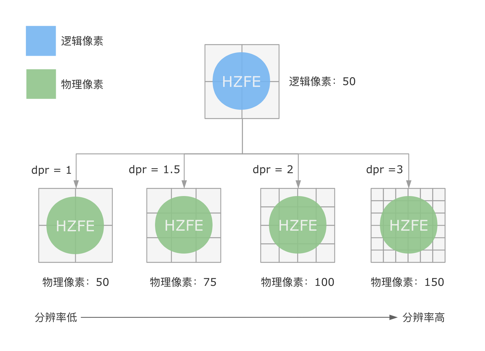

### 移动端自适应的常见手段

移动端开发的主要痛点是如何让页面适配各种不同的终端设备，使不同的终端设备都拥有基本一致的视觉效果和交互体验

- 视口元信息配置
- 响应式布局
- 相应单位
- 媒体查询
- 响应式图片
- 安全区域适配

#### 像素

像素：

分辨率：分辨率是指位图图像中的细节精细程度，以每英寸像素衡量。每英寸的像素越多，分辨率就越高

物理像素：物理像素是一个设备的实际像素

逻辑像素：是一种抽象概念。在不同的设备下，一个逻辑像素代表的物理像素数不同。css像素是逻辑像素

设备像素比：当前显示设备的物理想分辨率与css像素分辨率之比

#### 视口

视口一般是用户访问页面时，当前的可视区域范围。

布局视口：布局视口默认宽度是980px通常比物理屏幕宽。css布局会给予布局视口进行计算。移动设备的浏览器基于虚拟的布局视口去渲染网页，并将对应的渲染结果缩小以便适配设备的实际宽度

#### 使用viewport元标签配置视口

width控制视口的大小，device-width指代设备屏幕宽度
initial-scale 页面首次加载时的缩放级别

#### 使用现代响应式布局方案

1. 需要一维还是二纬布局：flexbox基于一条主轴方向进行布局。css grid可以划分为行和列进行布局。

2. 专注布局结构还是内容流：flexbox专注于内容流。css grid专注于精确的内容布局结构规则

#### 使用媒体查询

媒体查询允许开发者根据设备类型和特征（如屏幕分辨率或浏览器视口宽度）来按需设置样式。

#### 使用相对单位

根据 W3C 规范可知，1rem 等同于根元素 html 的 font-size 大小

vw/vh

#### 使用响应式图片

展示图片时，可以在 picture 元素中定义零或多个 source 元素和一个 img 元素，以便为不同的显示/设备场景提供图像的替代版本。从而使得图片内容能够灵活响应不同的设备，避免出现图片模糊或视觉效果差以及使用过大图片浪费带宽的问题。

#### 适配安全区域

为保证页面的显示效果不被这些特征遮盖，需要把页面限制在安全区域范围内
